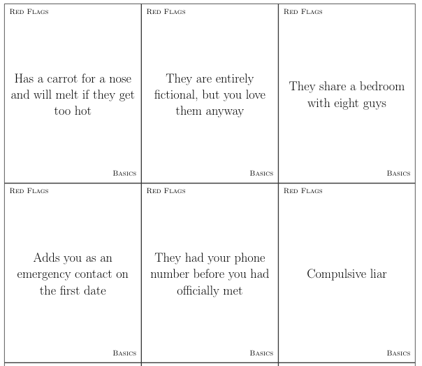
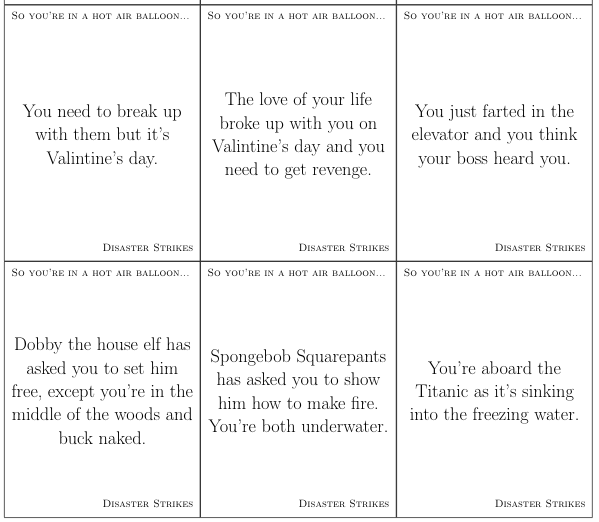

# Card Game Builder
(Lewd language warning)

## Quickstart
Go to the 
[`pdfs/`](https://github.com/beyarkay/card_game_builder/tree/main/pdfs) 
folder and download the card games you want. The instructions for each game
are on the first page of the pdf. Currently, the card games available are:

- Cards Against Humanity
- Chameleon
- Fake Artist Goes To NYC
- Most Of These People Are Lying
- No Thanks
- Paranoia
- Red Flags
- So You're In A Hot Air Balloon

### Convert card game ideas into printable PDFs you can cut out! 

Lots of card games boil down to basically just a load of creative prompts on
cardboard which you. Think 
[Cards Against Humanities](https://www.cardsagainsthumanity.com/#downloads), 
[Red Flags](https://www.timelessboardgames.co.za/boardgames/red-flags-main-game/1985),
[Chameleon](https://bigpotato.com/products/the-chameleon), etc

This project aims to make it simple to create your own card games by writing up
your prompts in a file. The Rust program will then convert that file to a PDF
with nicely formatted cards which you can print off, cut out, and then play
with.

### Examples
Red Flags (see [`pdfs/red_flags.pdf`](https://github.com/beyarkay/card_game_builder/tree/main/pdfs/red_flags.pdf)) for the full pdf):



So you're in a hot air balloon:



## Features

- Open source
- Multiple card games are already in the repository
- Easy (and flexible) interface via standard 
  [YAML](https://sweetohm.net/article/introduction-yaml.en.html) markup files

## How to print the files and start playing

First you'll need to download the PDF files. You can easily do this by going to
[`pdfs/`](https://github.com/beyarkay/card_game_builder/tree/main/pdfs) and
downloading the games you're interested in. Instructions and game information
are all on the first page of the pdf.  

Once you've got the PDF, it's really worth the effort to take it to a print
shop and ask them to print it out for you on card, and then ask to use their
guillotine (or ask if they'll cut it up for you). This makes the game much more
playable than trying to print it out yourself on regular printer paper.

Once you've got all your cards cut out, I _highly_ recommend buying a box or
two of small circle stickers and putting one sticker around the corner of each
playing card. This will make it obvious which game it is (ie a red circle for
the game _Red Flags_ or a black dot for _Cards Against Humanity_) and also make
it much easier to keep all the cards the right way up.

You can also often get long thin plastic boxes from a plastics warehouse which
are perfect for holding the cards.

Beyond this, you're basically done. Enjoy the game and be sure to leave
comments/feature requests if you find something that could be improved!

## Creating your own card game

Making your own card game is super simple. First, you'll need to download the
code:

### Installation

Assuming you've [installed git](https://git-scm.com/downloads) and have also
[installed rust](https://www.rust-lang.org/tools/install), simply `git clone`
and then `cargo run`:

1. `git clone https://github.com/beyarkay/card_game_builder.git`
2. `cd card_game_builder`
3. `cargo run`


### Defining your own game as a `YAML` file

The Rust code expects to be given a `.yaml` file, and will write one or more
`.pdf` files. This `.yaml` file is what you'll write to describe your game, and
must include _everything_ about that game, including:

- The name of the game, version number (following [SemVer](https://semver.org/)), instructions, number of players, duration, authors, and website:

```yaml
name: Red Flags
version: 0.1.0
instructions: We are all introducing one lucky
    friend to what we believe is their perfect match!
    When it's your turn, choose 2 perks you believe
    they would like in a person they date. After all
    perks are placed, you will have the chance to
    destroy your opponents adding a red flag to their
    applicant. Then your friend has to pick the best
    (or least worst) applicant, if yours gets picked,
    you get a point!
num_players: 4 or more
authors: Darin Ross, Skybound Games
website: https://www.amazon.com/Red-Flags-400-Card-Main-Game/dp/B018EXPGPI
duration: Multiple rounds of about 20 minutes each
...
```

- The game format is designed to allow you to expand upon the game later. You
  do this by defining one or more `expansions` (like `The Base Game`, `The
  Halloween Expansion`, `The Nerdy Expansion`, etc) and then each of these
  expansions should have one or more categories. Expansions are described in
  more detail below.
- The categories are used if you need different types of cards (like red flags
  and green flags in the game Red Flags, or like black cards and white cards in
  the game Cards Against Humanities).
- Within each category is where you actually write your prompts for the game.
  For example:

```yaml
...                     # The preamble described above isn't included here
expansions:                 
  - base:               # This is the `base` expansion, defining the main game
    name: The Base Game # Each expansion should have a name, which will be
                        # printed on the card
    categories:         # The base expansion has 2 categories:
      - red_flags:      # The first category is Red, for bad personality traits
        name: Red       # Each category should have a name, which will be
                        # printed on the card
        items:
          - Adds you as an emergency contact on the first date
          - They had your phone number before you had officially met
          - Compulsive liar
          ...
      - green_flags:    # The second category is Green, for good personality traits
        name: Green
        items:
          - They know how to take a compliment
          - They make your ex jealous
          - Has a magic bag that contains unlimited cheese
          ...
```

See the [full yaml file for Red
Flags](https://github.com/beyarkay/card_game_builder/blob/main/games/red_flags.yaml)
for a complete example, or see the [template yaml
file](https://github.com/beyarkay/card_game_builder/blob/main/games/template.yaml)
for something you can copy-paste and then fill out the details yourself.

All the 'metadata' information (instructions, number of players, creation date,
etc) will be printed on the first few cards and specially formatted so that you
can just bundle the instructions together with the playing cards in the same box
and not have to worry about losing it.

### Halp! Printing all this is getting expensive

If you've got a lot (over 500) cards, then printing them out all at once might
be too expensive. You can define _expansions_ of your card game, such that each
expansion is mutually exclusive. This allows you to first create a small batch of
cards, print them out, and then if you want to create more cards you can define
them as a second expansion in the same `.yaml` file and tell the program to only
print out the second expansion. This way you can split the costs into smaller
batches, or give the base game as a gift, and later give expansions to the same
game as subsequent gifts.

You could also treat the different expansions as themes for the game, like _The
Halloween Expansion_, _The Sexy Expansion_, _The University Expansion_, _The
"People I've Dated" Expansion_, etc.

Example yaml using multiple expansions:

```yaml
...
expansions:
  - base:                       # The base expansion, for the base game
    name: The Base Game
    categories:
      - red_flags:
        ...
      - orange_flags:
        ...
      - green_flags:
        ...
  - nerdier:                    # The Nerdy expansion, for nerdy red flags
    name: Nerdier Red Flags
    categories:
      - red_flags:
        ...
      - orange_flags:
        ...
      - green_flags:
        ...
  - fairy_tale:                 # The Fairy-tale expansion, for magical flags
    name: Fairy-tale Flags
    categories:
      - red_flags:
        ...
      - orange_flags:
        ...
      - green_flags:
        ...
```

## YAML Card Game File to PDF

Once you've created your `yaml` file, you'll need to run the rust code to compile
the `yaml` to a PDf that you can print.

This is as simple as running the Rust code and passing in the path to your
`.yaml` file. 
```sh
cd card_game_builder
cargo run games/cards_against_humanities.yaml
```

You can optionally pass in the expansion(s) you'd like to generate as quoted
strings:
```sh
cd card_game_builder
cargo run card_game_builder games/cards_against_humanities.yaml "The Sexy Expansion" "The Chrismas Expansion"
```

The `.yaml` files are first converted to `LaTeX`, via the
[flashcards](https://www.ctan.org/tex-archive/macros/latex/contrib/flashcards/)
class, and then that `LaTeX` file is compiled to a pdf document. If the LaTeX
compilation succeeds, then the original `tex` files are deleted.

## Contributions

Contributions are very welcome! And they don't have to be code either. If
you've got a card game file that you'd like to contribute, then submit a pull
request and I'll add it.

Features, bug fixes, and improvements are also welcome!

## Future game ideas
- (Super Fight Live)[http://www.superfightlive.com/the-game/]: Build your
  fighter with character cards (like Zombie, Shark, or George W. Bush) and
  attribute cards (like Super Speed, Armed with a Chainsaw, or Has Tiny T-Rex
  Arms). When it’s your turn, combine a character card with a couple of
  attribute cards to construct your fighter, then it’s up to you to make your
  case to an audience of friends or Twitch! The included FREE Blue, Purple, and
  Challenge Decks also allow players to throw hundreds of random locations,
  scenarios, and challenges into the mix for even MORE mayhem. Additional themed
  decks, like the R-rated Red Deck or the Geek themed Orange Deck, are available
  to purchase, with even more hilarious digital decks to come in future updates!
- (Business Panda Beach
  Party)[https://www.kickstarter.com/projects/jackdire/business-panda-beach-party/description]:
  One player at a time takes the stage, and is given randomly-assigned
  characters and attributes to act out. But here's the catch: THE PLAYER ON THE
  STAGE CAN ONLY USE ONE WORD THROUGHOUT THEIR ENTIRE TURN.

  The default word used is "bamboo", or the game can be played with players using
  a word chosen by the opposing team. Use the player's ex's name. Use a word that
  disgusts them. Use "anthropomorphic". You get it.

  Teammates then select the cards they believe are being acted out, and are
  awarded points based on correct guesses, with penalties for incorrect guesses
- Expand out the existing card games

## Future code ideas

- Actually convert `.tex` files to LaTeX automatically
- Actually have front matter on the first few cards
- Use the GitHub releases feature instead of committing `.pdf` files to source
  control

